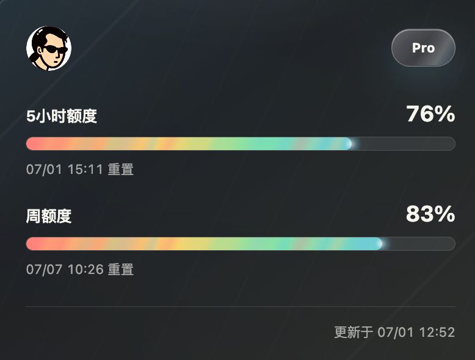

# Codex Quota Web

一个轻量的 Codex 额度卡片页。服务端读取本机 `~/.codex/auth.json`，拉取 Codex 额度后，只把展示所需的用户信息、剩余额度和重置时间返回给前端。

A lightweight Codex quota card. The server reads the local `~/.codex/auth.json`, fetches Codex quota data, and only returns the user profile fields, remaining quota, and reset times needed by the frontend.




## 重要功能 / Features

- 展示 5 小时额度和周额度的剩余百分比
- Shows the remaining percentage for the 5-hour quota and weekly quota
- 显示额度重置时间和最近更新时间
- Shows quota reset times and the latest update time
- 支持头像、套餐标识、卡片翻面和背面额度铭文
- Supports avatar, plan badge, card flip, and the inscription panel on the back
- 支持卡片倾斜、周期扫光和进度条流光动画
- Supports card tilt, periodic shine effects, and animated progress bars
- 点击或键盘操作进度条可临时显示重置倒计时
- Click or use the keyboard on a progress bar to temporarily show the reset countdown
- 服务端定时刷新额度缓存，前端无需接触 token
- The server refreshes the quota cache on a schedule, so the frontend never touches tokens

## 启动 / Start

```bash
npm start
```

默认地址：

Default URL:

```text
http://localhost:8787
```

可通过 `PORT` 修改端口：

Use `PORT` to change the port:

```bash
PORT=9000 npm start
```

## 注意 / Notes

这个服务会在服务端读取并必要时刷新 `~/.codex/auth.json`。不要把 `auth.json`、access token、refresh token 或服务端日志暴露到前端。

This service reads and refreshes `~/.codex/auth.json` on the server when needed. Do not expose `auth.json`, access tokens, refresh tokens, or server logs to the frontend.

页面保留了空闲状态下的进度条流光和卡片扫光动画；如果需要低功耗展示，可以在系统中开启“减少动态效果”，页面会自动大幅减少动画。

The page keeps idle progress-bar flow and card shine animations. For a lower-power display mode, enable Reduce Motion in the system settings; the page will automatically reduce animations significantly.
